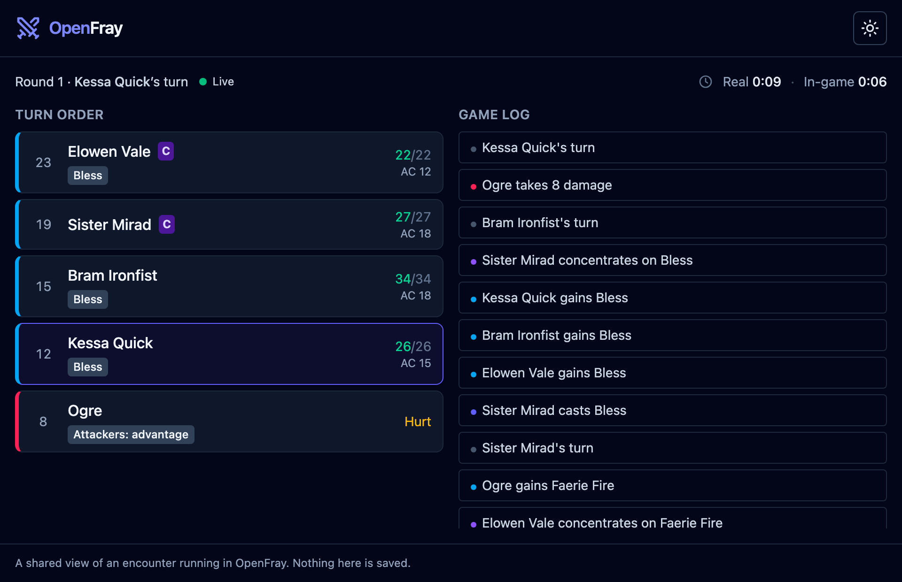
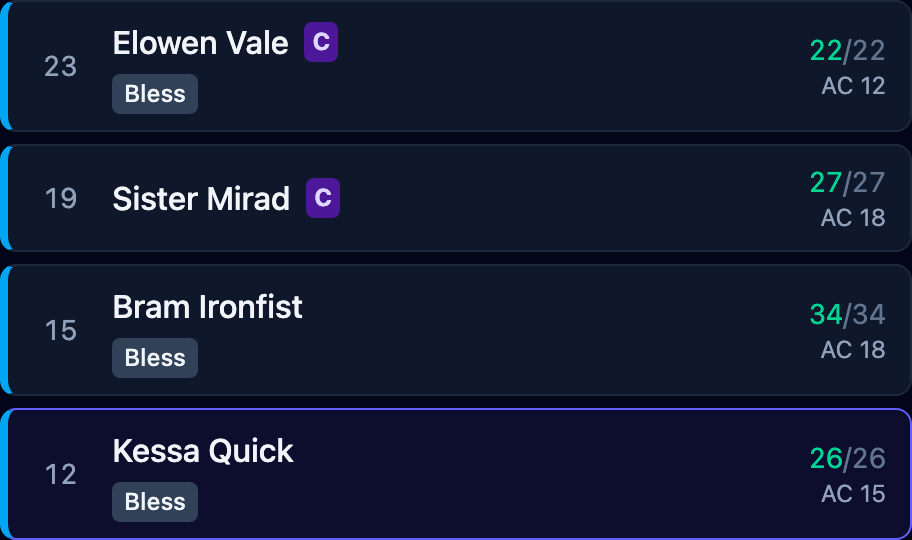
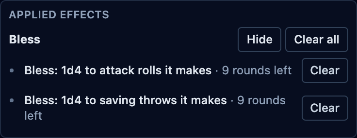

Before I used a DnD initiative tracker, I kept the turn order on paper. Writing
everything down before a fight could start took anywhere from 30 seconds to five
minutes.

The turning point was running _Curse of Strahd_, when the party arrived at the
winery. I won’t spoil what happens there. If you’ve run it, you’ll know the scene.
That session included a single fight that took about three hours.

Keeping track of it was a nightmare. Group saving throws, attack rolls all over
the place, and overlapping conditions: I had to keep all of that straight while
running the fight. My initiative list told me who went next, but the rest still
needed notes and reminders.

Now I put a tablet in front of my Game Master screen, facing the players. It has
OpenFray’s player view open: the turn order, the effects on each character, and the
game log. Players keep their phones open to D&D Beyond or roll physical dice.

That setup has helped me speed up fights. Players can see when their turn is
coming and check what affects their character. Behind the screen, I can see which
effects I need to apply and who has them.

[OpenFray’s combat console](/console/) holds that information for both sides of
the screen. Here is how I use it at an in-person DnD table.

## Put the turn order where everyone can see it

On paper, I can write down initiative and keep it beside me. But a list behind my
screen still leaves the players relying on me to tell them whose turn comes next.
I have to run the creatures and keep announcing where we are in the order.

The tablet gives the players a list they can check themselves. The current turn
is highlighted, and everyone can see who follows it. They don’t have to remember
the initiative order while thinking about what their character will do.

One tablet serves the table. Players can leave D&D Beyond open on their phones
for their character sheets and rolls, or keep using paper sheets and physical
dice. They don’t each need another page open to follow the fight.

## Keep concentration and effects beside the character

Turn order is only part of what players need to remember. Who is concentrating?
What effects are on my character? Is that condition still there?

The player view shows a concentration marker beside the caster and effect badges
beside the characters they affect. The game log records spells being cast,
effects being applied or removed, and concentration starting or breaking.

That puts the reminders in front of the players while someone else takes their
turn. They can check their own character’s row and look back at the log for what
changed. I spend less time repeating those details across the screen.

The view is read-only. Players see the fight; I still make the changes in the
console. I choose how much creature information reaches their screen, and creature
stat blocks stay on my side.

The [player-view feature page](/features/player-view/) shows what you can reveal
and keep private. The [sharing guide](/docs/guides/player-view/) covers setup.

## Keep the effects I need on my side, too

My paper notes also had to hold which creatures were affected by which spells.
A name and a hit-point total weren’t enough once several effects were running.
I needed to remember what changed the next roll and when it ended.

In the console, those effects stay with the creature or player character. I can
check the row before acting and see who has what, without finding the spell in a
separate note.

In this sample fight, Bram has Bless. My side shows which rolls it changes and
how much time remains; the players’ screen keeps it to a badge beside his name.

I still have to record what happens. OpenFray doesn’t read a physical die or pick
up a roll from D&D Beyond. If a player rolls there or at the table, I enter the
result or apply the change in the console. I add effects it cannot apply for me,
and remove a condition when the action at the table ends it.

The [earlier article on tracking effects](/news/what-your-initiative-tracker-forgets/)
shows Bane, Faerie Fire, and Prone reaching the right rolls in one fight.

## Where the time went

The improvement at my table came from fewer pauses to work out whose turn it was
or reconstruct which effects were still running. Players had the turn order and
their effects in front of them. I had the same fight on my side, with the controls
and creature details I needed.

Paper can hold all those notes. With OpenFray, I update the board once and the
shared screen follows. Changing a turn or removing an effect doesn’t also need
a separate update to a player-facing list.

## Put a tablet in front of your screen

[Open the console](/console/) and add your party and a few creatures. Run as many
fights as you like without an account. The console is free and ad-free.

The player view works without an account, too. Click **Share with players**, then
**Start sharing**, and open the copied link in the tablet’s browser. Keep your GM
console open and connected while the tablet follows the fight. Give the full link
only to your table.

Choosing a custom player-view code takes a free account. You can share the player
view using its generated code without signing in.

Put the tablet where everyone can read the turn order. Leave character sheets and
dice wherever your players already use them, and record the changes in the console
as you run the encounter.
