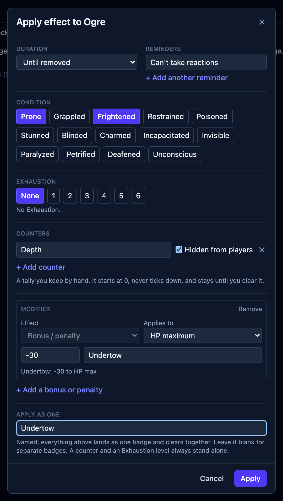

Your players can check whose turn comes next on their own phones. You choose which
creatures and details they see, while you keep running the fight.

The player view arrives in OpenFray 1.0, taking the combat console out of beta.
OpenFray is free, runs in a browser tab, and needs no account to run a fight.

[Open the console](/console/) and share the turn order with your table.

## Give the table its own screen

Your table now gets a screen of their own. Share a link, and everyone reading it sees the
turn order and the game log on their own phones, updating as you run the fight.

What reaches that screen is yours to decide:

- **Hide a creature, or reveal it early.** A creature the party hasn't seen stays off the
  view until you show it.
- **Keep a creature's conditions to yourself.** The table sees that something is happening
  without seeing which effect you applied.
- **Let a creature fight for the party.** A summoned bear or a charmed guard sits with the
  players rather than against them.

The shared log shows action names and roll totals, with the dice breakdown left out.
Saving throws reach it after you settle them. The fight’s clocks, damage dealt by
each side, and end-of-fight summary go across too.

The log starts fresh with each fight, sharing survives a reload, and it ends when you
close the tab. A link can be named, so you can tell one table's view from another's.

Every part of it is written up in [the handbook](/docs/guides/player-view/).

## Apply the whole effect together

An effect with a condition, a modifier, and a reminder can now be applied as one
named bundle. Stage it in **Apply effect**: it logs as one entry and clears together,
so you have one effect to remove when it ends.

- **Bonuses apply to the rolls you choose.** Scope a modifier to Dexterity saving
  throws, for example. Bless and Bane apply to attacks and saves.
- **An effect can be yours alone.** Mark it for the Game Master, and the count you are
  keeping stays off the table's screen.
- **Effects reach a character's numbers.** Armor class, initiative, hit point maximum and
  Speed are derived for a saved character, and an effect can move any of them. A Speed
  modifier can halve it, double it, or drop it to 0.
- **A spell’s effects arrive together**, in a bundle named for the spell. Spell effects
  were checked against the rules text of both editions.
- **Exhaustion has a level**, and lands from an attack or a saving throw like anything else.
- **Save an effect you use often as a preset.** The diseases from _Brood & Bloom_ ship as
  presets already.

## Dice you can check

An advantage roll shows both dice and says which one counted. A damage roll shows the dice
behind the total. Every roll carries to its total with an arrow, and a natural 1 is named
a critical miss rather than left to be noticed. There is a reroll wherever OpenFray rolls.
A group saving throw applies each creature's own resistances and immunities by damage type,
and says what it rolled for whom.

The rolls come from [opendice](https://github.com/SirDarcanos/opendice), which uses a
cryptographic random generator and returns every die for the log to display.

## More material for your next session

**[On Strong Waters and Potent Simples](/strong-waters/)** is the third book OpenFray
writes, and the first with no creatures in it. Hesper Aldwine's eight chapters cover
drink, smoke and the simples: what they do, what they cost, where they are found, and what
happens to someone who keeps taking them. It ships with three appendices, a print edition,
and 11 spells you can cast from the console. Its three counts are effect presets:
Intoxication, Craving, and Addiction. You can apply those presets from the effect controls.

**Creature Codex** joins the opt-in libraries, alongside the three Tome of Beasts books.
Tick it in **Settings** and its creatures appear in the compendium with their own source
line.

_Brood & Bloom_ also gained its spells as a castable library, and the Hands of the Host.

## Try it with your table

[Getting started](/docs/getting-started/) walks through a first fight, and the
[player-view guide](/docs/guides/player-view/) explains how to share it. The
[changelog](https://github.com/OpenFrayApp/openfray/blob/main/CHANGELOG.md) records
what changed in each release.

You can run a fight without an account. A free account keeps your custom creatures,
characters, and campaigns available across devices for the next session.

[Open the console](/console/) to add your party and share the turn order. Sign in
with Google or Discord when you want to keep your table’s material.
