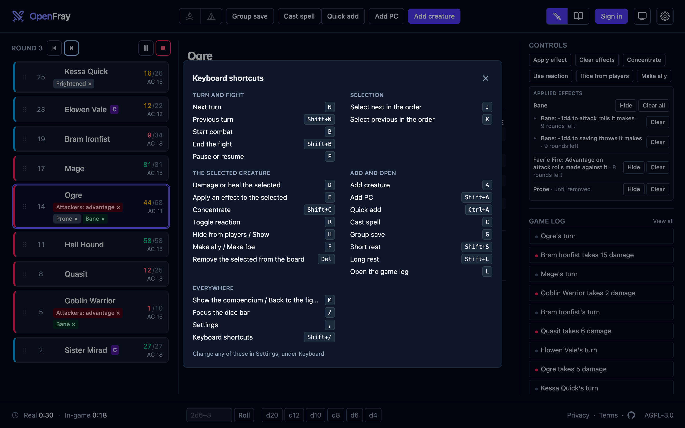

OpenFray 1.1 gives phones and tablets their own layouts. At a laptop, keyboard
shortcuts let you advance turns, apply effects, and cast spells without reaching
for the mouse. You can change the keys to suit you.

OpenFray is a free combat console for Game Masters running DnD 5e, compatible with
5.5e and 5e. It runs in your browser, with no account needed for a fight.

[Open the console](/console/) on the device you bring to the table.

## The console in your pocket

Swipe between the tracker, stat block, and controls on a phone. Tap a creature to
open its stat block, or use the bottom bar to jump to another screen.
Panels open as sheets, and controls have larger touch targets.

A portrait tablet uses the same layout. Turn a small tablet sideways and the tracker
sits beside the stat block, with controls and the log below. A laptop keeps the
three-column view.

## Run it from the keyboard

Advance the turn with `N`, select creatures with `J` and `K`, or press `D` to reach
the selected creature’s hit points. `E` opens effects, `G` opens a group save, and
`C` opens spellcasting.

Press `Shift+/` for the full list. Change any shortcut in **Settings → Keyboard**
to fit the keys you use at the table.

## Let the turn clear the effect

Set an effect to end at the start or end of any creature’s turn. For “Charmed until
the start of its next turn,” choose that turn in **Apply effect** and the console
clears it when the turn arrives.

Add **or its next roll** to end an effect early on the first roll it changes.
It replaces the old “This turn / next attack” option; effects saved with that option
still work.

Group saves, concentration checks, and stat-block rolls now clear the effects they
spend. Vicious Mockery, Latchwork, Guiding Bolt, Guidance, and Resistance also have
corrected duration bounds, checked against both editions.

The [effects guide](/docs/guides/effects/) covers durations and the controls for
applying them.

## Keep the spell’s effect after the hit

Guiding Bolt now applies its effect to the target it hits. Flame Blade, Spiritual
Weapon, Arcane Hand, Arcane Sword, and Vampiric Touch leave their reminders on the
caster after resolving the attack.

A saved character's spell attack bonus and spell save DC are filled in from the class,
level, and ability scores you transcribed. A multiclass caster, a subclass caster, and
an anonymous character leave the field to you, as before. Casting has
[its own handbook page](/docs/guides/spells/).

## Write notes on the campaign card

Campaigns now carry private notes for your threads and hooks. Write Markdown in the
campaign form or directly on its card. The
[campaign guide](/docs/guides/campaigns/) explains where to find them.

## In the books

[_Brood & Bloom_](/brood-and-bloom/)'s **Reliquary Imago** and **Tallow Imago** now say where their size
comes from. Both open from a husk built around a much smaller larva: the case holds the
body, and the wings come out folded and open as the moth rises. The sizes themselves
are unchanged.

## Smaller things

- A condition chip is lit when the target has that condition. Tapping a lit chip
  clears the condition.
- A picker says what it just added.
- [The compendium](/docs/reference/compendium/) follows the same layout switch as the
  fight.

## Bring the device you have

[Getting started](/docs/getting-started/) walks through one fight, from an empty board
to the summary at the end. The
[changelog](https://github.com/OpenFrayApp/openfray/blob/main/CHANGELOG.md) records
this release’s changes.

A free account keeps your characters, custom creatures, and campaigns available
across devices. Your keyboard preferences stay in the browser where you set them.

[Open the console](/console/) on your phone, tablet, or laptop. Try a fight, then
sign in with Google or Discord to keep your party and campaign for next time.
