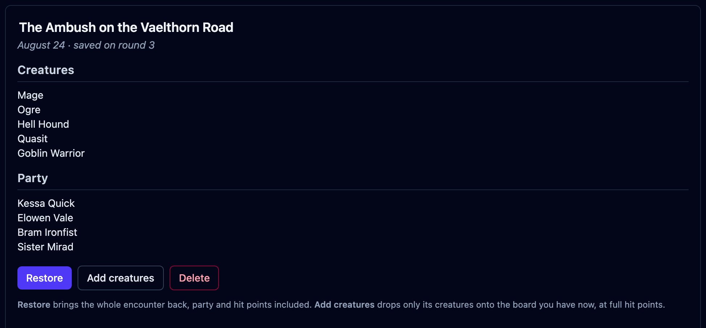
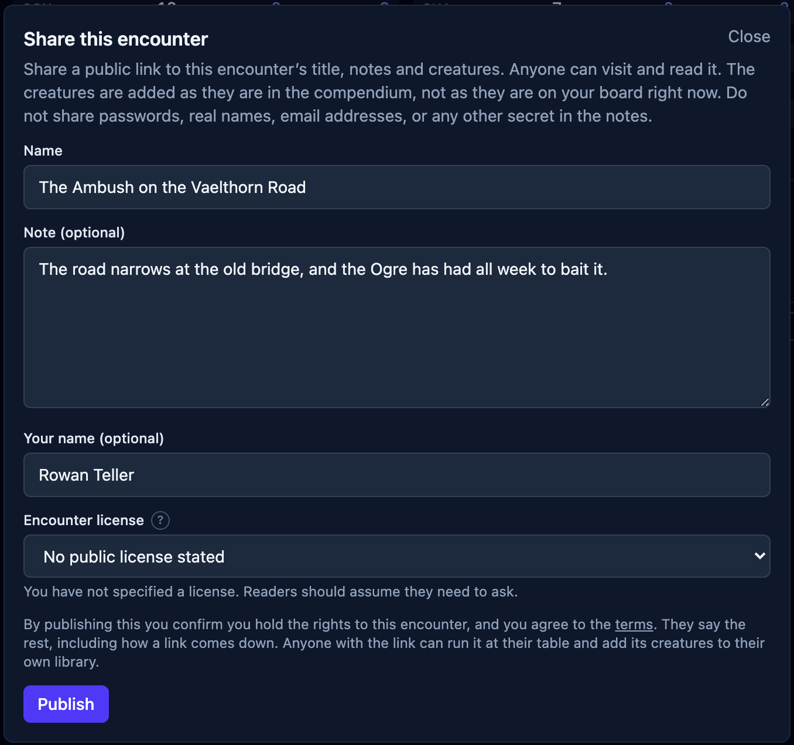
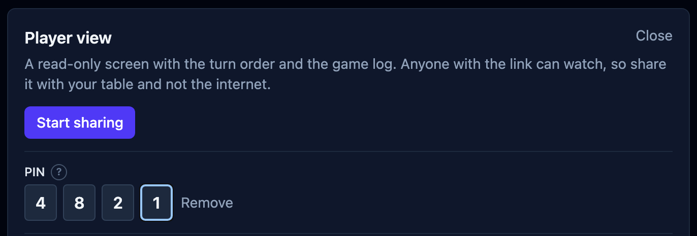
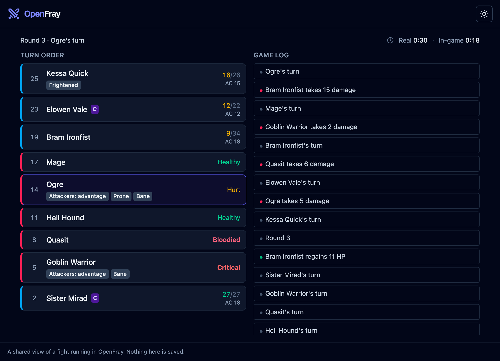
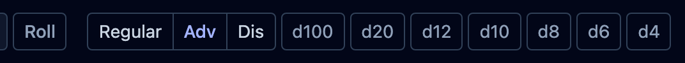

The session ends halfway through a fight. Save the board and pick up next week with
the same hit points, effects, and turn order. Or prepare an encounter early and send
another Game Master a link they can use at their own table.

Saving and publishing arrive in OpenFray 1.2. The combat console is free, runs in your
browser, and needs no account to run a fight. A free account lets you save and publish.

[Open the console](/console/) and put your next encounter on the board.

## The session that ended mid-fight

Sessions rarely end on a clean round. **Save** keeps the board exactly as it stands: the
creatures, the party, hit points, effects, conditions, initiative, the round you are on,
and the log. Next week you open it and carry on.

It works the other way round too. Build the fight on a Tuesday, save it, and it is
waiting on Saturday with the cast already assembled. Prep a month of them if you like.
Save as many as you want, as often as you want.

Saved fights live in the compendium under **Encounters**. Each card shows what was on the
board, grouped and counted, so you can tell one goblin ambush from another without opening
either.

**Restore** brings the whole encounter back, including the party and hit points.
**Add creatures** puts its creatures on your current board at full hit points, ready
to run the same ambush for a different group.

A free account keeps your saved encounters available on the device you use for the
next session.

## Hand an encounter to somebody else

**Publish** puts an encounter, or one creature, at a link anyone can open. They read it in
the browser, and add it to their own board with one click.

Send the link to the Game Master who asked how you ran the ambush. Add it to a blog
post or video description so readers can load the encounter you describe.
You can also publish a creature you wrote for other tables to use.

A published encounter shares the cast, its name, your note, a byline, and a license.
Your player characters and the state of the fight stay private: hit points, effects,
initiative, and the log are left out.

Publishing needs a free account, which also gives you control over taking the link down.

### Two licenses, kept apart

An encounter carries a license covering **your own words**: its name, your note, and which
creatures you put together. Each creature carries whatever **its own author** gave it.
Collecting a stat block does not relicense it.

A creature without a reuse license can be read on the page but is excluded when
someone adds the encounter. The console lists those creatures before adding anything.
The default is no license; that does not grant permission to reuse the creature.

A creature can also say where it came from, and the stat block shows it. A creature brought
in with the OpenFray Importer cannot be published at all: those stat blocks are Wizards of
the Coast's.

### Everything you have up, in one place

**Shared links**, under your account, lists what you have published: copy a link again, open
it to see what a reader sees, or unpublish it. Unpublishing is immediate and final.

Links have no automatic expiry. An account holds up to 200 published pages;
unpublishing makes room.

## Reading somebody else's link

A shared link opens its own page without loading the console: the cast, the note, the
byline, and every stat block. **Use this encounter** puts the creatures on your board.

Every published page carries **Report this**. Anyone can use it, nobody is asked who they
are, and an address is optional. Reports reach a person. A page that breaks the
[terms](/terms) is removed, and whoever published it is told. A page that was taken down
says so, rather than reading like a code somebody mistyped.

Shared stat blocks are validated before use. Notes support bold, italic, quotes,
lists, and headings, with content that navigates or fetches excluded.

## Set up the table’s screen

Give your [player view](/features/player-view/) a PIN, a campaign backdrop, and a
heading with the campaign and Game Master names. The sharing control now uses a cast icon.

Set a **four-digit PIN** for the player-view link. Viewers enter it before the board
appears; a wrong PIN leaves the board hidden.

Choose a **backdrop** for the campaign: a mountain fortress, desert ruin, elven city,
frozen lake, and more. Each backdrop has its own light or dark treatment;
the theme toggle is disabled while one is displayed.

The screen can also head itself with the **campaign's name and yours** as the Game Master
running it. Each is its own setting under Player view, both off by default, and neither
travels on an anonymous link.

## The dice bar

Roll a **d100** from the dice bar, or choose Regular, Adv, or Dis before pressing a
die. The mode applies to any die. A d20 rolled at advantage is labeled that way in
the log, with both dice available to inspect.

## Smaller things

- The player view moved to `openfray.app/p/`, beside published encounters at
  `openfray.app/s/`. Both sit at the root of the domain, because they get pasted where
  somebody who has never seen the console will read them.
- Neither is counted by its code: analytics sees `/s/` and `/p/` and nothing after them.
- Signing out hands a shared link back to an anonymous one, so a device that no longer owns
  your name stops broadcasting under it.
- **Rests**, **Group save** and **Cast spell** hold their place in the header on an empty
  board and grey out, instead of vanishing. **Save** greys out the same way sharing already
  did.
- A condition named in a spell's rules text, or in the **Applied effects** list, explains
  itself on hover, the way one in the tracker already did.
- A field's description sits behind the **?** beside its label, so what stays visible is
  state or consequence rather than boilerplate.
- The short-rest tally sits in the campfire button's corner, off the artwork.
- The compendium's tabs lay out three by three.
- The app says **encounter** where it used to say fight.

## Prepare the next session

The handbook explains how to [save a fight](/docs/guides/saving/),
[publish an encounter](/docs/guides/publishing/), and
[share the player view](/docs/guides/player-view/). The
[changelog](https://github.com/OpenFrayApp/openfray/blob/main/CHANGELOG.md) records
the full release.

[Open the console](/console/) to build your next encounter. Sign in with Google or
Discord to save it for your own table or publish it for another Game Master.
