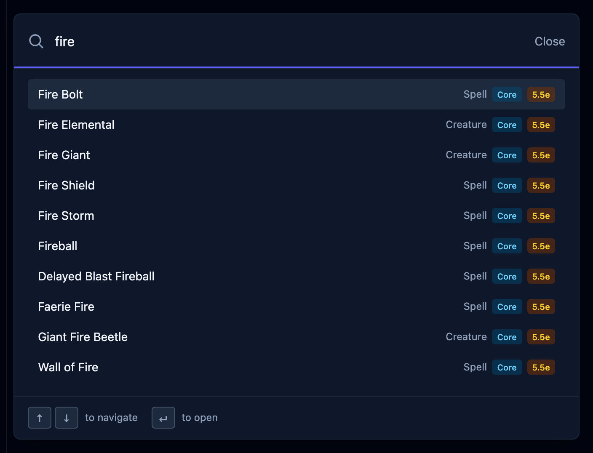
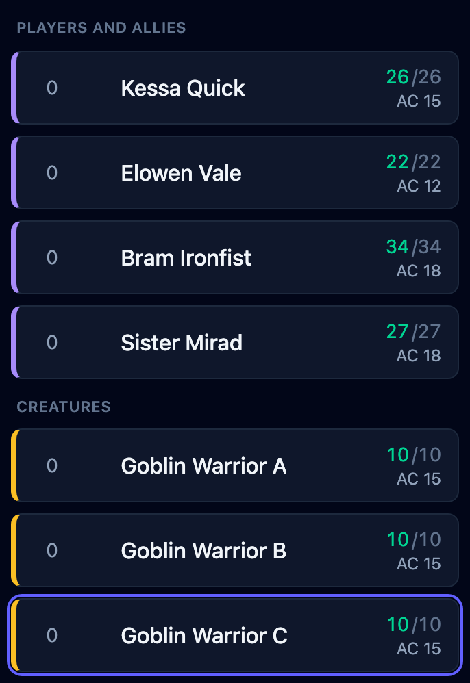
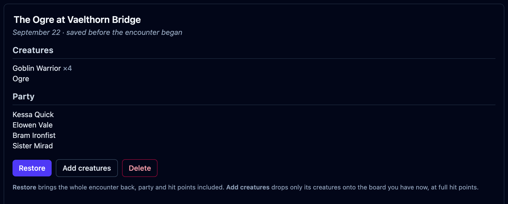

A player names a spell. Three goblins need telling apart. The session ends halfway
through a fight. OpenFray 1.3 brings reference search, creature labels, and recovery
controls to those moments at the table.

OpenFray is a free combat console for Game Masters running DnD 5e. It keeps initiative,
hit points, and effects together in a browser tab. You can run a fight without an
account or anything to install.

[Open the console](/console/) to try it with your next encounter.

## Find the spell while the table waits

Look up a spell or condition from the header while the encounter stays open.
The same search finds creatures, saved characters, and console navigation, with
creatures from every enabled library and the available spells in its results.

You can cast a spell straight from search, even before anyone is on the board.
Results scroll, and you can choose a keyboard shortcut in **Settings**.

## Keep the goblins straight

Goblin B leaves the board. Goblin C keeps its letter, so the creature your players
have been calling C is still C on its next turn.

Repeated creatures can use numbers, Roman numerals, or letters. Choose a style in
**Settings → Tracker**; it applies to new labels and leaves existing labels and
names you typed unchanged.

Choose creature and ally marker colors that you can distinguish against your
background. The shared player view follows your tracker colors by default.
If the table’s screen needs different colors, you control those overrides too,
without changing your own tracker.

Each color has its own reset arrow. Resetting a player-view override makes it follow
the tracker again. The handbook covers [tracker settings](/docs/reference/settings/#tracker)
and [player-view settings](/docs/reference/settings/#player-view).

## Recover an interrupted fight

Version 1.3 adds offline recovery and security protections for the encounter you are
running, including session recovery, safe updates, and more reliable shared player views.

When your device and the cloud both contain changes, the console asks which board
copy you want to continue. The other stays available for recovery, and you can
download both before choosing. If saving fails, you can retry or download a recovery copy.

Updates wait for you to review them. **Update and reload** checks the encounter’s
recovery copy before reloading. Finish open forms first: unfinished form entries
are lost in the reload.

## Smaller things

- The sign-in page is simpler: choose Google or Discord directly, with the Terms
  notice beside the buttons and no checkbox.
- Keyboard focus is visible, and initiative rows support arrow-key reordering.
- Repeated touch controls have larger targets.
- The tracker has updated cleanup icons, and the game log heading separates it from
  the controls.

The [unified changelog](https://github.com/OpenFrayApp/openfray/blob/main/CHANGELOG.md)
records the release across the console, website, and handbook.

## Put your next encounter on the board

Add the party and a few creatures, then run a fight. You can already save encounters
with a free account, ready to restore next session or open on another device.

The [saving guide](/docs/guides/saving/) explains how to restore the board or reuse
its creatures in another encounter.

[Open the console](/console/) to try a fight, then sign in with Google or Discord to
save it for your next session.
