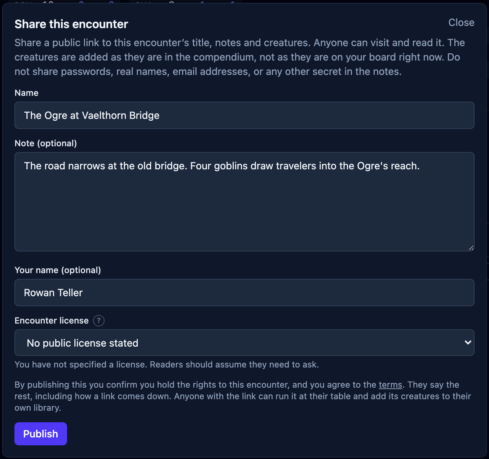

An encounter can start in three different places: a creature you want to use, a scene you
want to reach, or a difficulty you need to fill. It usually ends in the same place. You
have a list of creatures in one note, the party in another, and a browser full of stat
blocks to reopen on game night.

I would rather put the whole fight on the board while I am preparing it. [OpenFray's
console](/console/) lets me assemble the party and its opposition, check how hard that
lineup looks, and save it under the name I will recognize next week. If another Game
Master wants the same encounter, I can publish the creature lineup to one link instead of
sending them a list to rebuild.

## Build around the party that will face it

Start with the party. Add [saved player characters](/docs/concepts/combatants/#players)
from a campaign, or use **Add PC** for the names, hit points, and armor classes you need at
the table. Then add creatures from the compendium. Multiple copies group together while
you prepare, so four Goblin Warriors take one search and four clicks.

Before combat begins, the footer estimates the encounter as **Trivial**, **Easy**,
**Medium**, **Hard**, or **Deadly**. Add another creature and the estimate changes. Remove
one and it changes again. The experience point total stays beside it.

That label is a check, not a ruling. A saved character can carry their class, level, and
ability scores, but each one is optional. The difficulty estimate works the party's level
back from each character's hit points, and from Constitution when you have recorded it.
It gets closer with a saved party, but it cannot know that everyone spent their strongest
abilities in the last room, or that the bridge in this one favors the Ogre.

Use the estimate to catch the obvious mismatch while the encounter is still easy to
change. The choice stays yours: the console shows what the current cast adds up to, then
gets out of the way.

If you need the calculation behind the label, the handbook explains [how encounter
difficulty is estimated](/docs/guides/encounters/#how-hard-the-fight-looks).

## Save the encounter before game night

Once the board has the party and creatures you want, click **Save this encounter** below
the tracker and give it a useful name. “The Ogre at Vaelthorn Bridge” will make sense in
a month. “Session 12” probably will not.

Saving takes a free account. The first fight does not: you can [open the console](/console/)
and run it anonymously. An account is what puts the prepared encounter on the laptop or tablet
you bring to the next session.

A save keeps more than the creature list. It holds the party, hit points, effects,
conditions, initiative, current round, and log exactly as they stand. Save before the
fight and it is preparation. Save during round 6 and it is the place where next week's
session begins.

Saved encounters live under **Encounters** in the compendium. Each card shows the cast,
grouped and counted, so the name does not have to carry every detail.

## Restore the fight, or reuse the opposition

A saved encounter has two ways back to the board:

- **Restore** returns the whole snapshot. The party, hit points, effects, initiative,
  round, and log all come back. Use it to continue a fight or return to the exact setup
  you prepared.
- **Add creatures** puts fresh copies of its creatures onto the board you already have.
  The saved party stays behind. Use it to run the same ambush for another group or keep a
  favorite creature lineup ready for later.

That distinction turns a save into more than a pause button. A roadside attack, a temple
guard, or a three-stage boss cast can remain in the compendium until another campaign
needs it.

The full sequence is in [Save a fight for later](/docs/guides/saving/).

## Share the encounter without sharing your campaign

A saved encounter is private. To hand the encounter to another Game Master, put its
creatures on the board and click **Share this encounter**.

Give the encounter a name and an optional note. The note can explain where the creatures
begin, what opens the fight, or which part of the terrain matters. Add your byline, choose
a license for your contribution, and publish it.

The published page carries the encounter's creature lineup, name, note, byline, and
license. It leaves behind your player characters, current hit points, effects, initiative,
and log. Another Game Master can read every stat block on the page, then choose **Use this
encounter** to place the reusable creatures on their own board.

Publishing needs an account because the page has a public address and somebody standing
behind it. You can copy the link again or unpublish it from **Shared links** under your
account.

Each creature keeps the license its author gave it. A creature without permission for
reuse can be read on the published page but will not copy to another board. Creatures
brought in through the OpenFray Importer cannot be published. The [publishing
guide](/docs/guides/publishing/) covers what travels, what stays private, and how those
licenses remain separate.

## Prepare one encounter now

[Open the console](/console/), add your party, and assemble the next fight. Watch the
difficulty estimate while you change the cast. When the lineup looks right, sign in to
save it for game night.

If somebody else should be able to run it, publish the encounter and send the link. They
can put its creatures on their own board without rebuilding your work.
