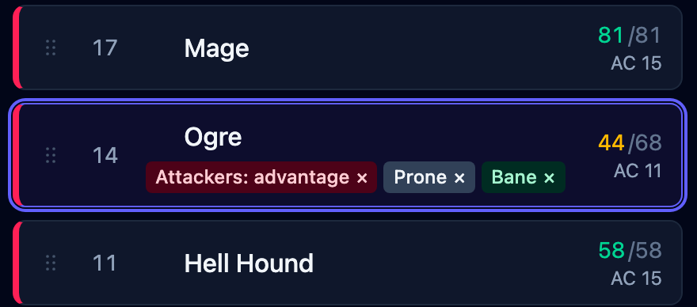
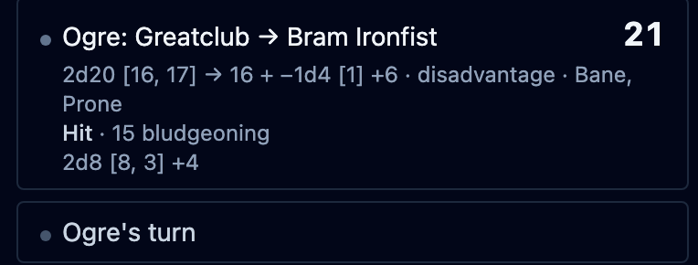
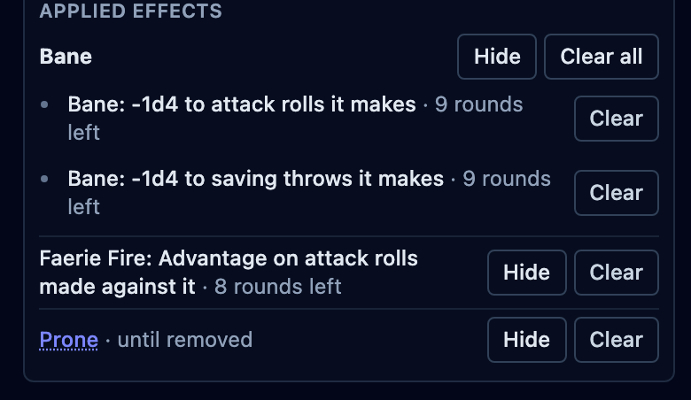

At my table, I used to rely on players to remind me which spells they had cast and who was
affected. That worked while the spell was fresh. Two or three turns later, I was looking at
the creature's turn, hit points, and stat block while the player was thinking about their
next move. One of us had to catch the effect before the next roll.

Did Bane still apply? Who was inside Faerie Fire? Was the Ogre still Prone? Sometimes the
reminder came after the dice had landed. Sometimes we missed the bonus or penalty entirely.

I use [OpenFray](/console/) to keep those effects on the board and apply them to the
rolls they change.

## How I track spells cast by players

When one of my players casts Bane, I cast it in the console on their behalf. They still
make their own rolls at the table. The action in OpenFray records what the spell changed:
the targets take the penalty to their attack rolls and saving throws, the caster begins
concentrating, and the duration starts.

Spells with effects the console can track add them to the chosen targets automatically.
Anything else can go on the board through **Apply effect**. That is how I add Prone, a
homebrew effect, or a reminder that needs my judgment when it comes up.

For this fight, the Ogre has three badges. Bane changes rolls the Ogre makes. Faerie Fire
changes attacks made against it. Prone affects both sides until the Ogre stands.

The badges stay on the Ogre's row. I do not have to remember which character supplied
each part when another creature acts. OpenFray looks at the creature making the roll and
the creature it is rolling against, then brings in the effects that apply.

## How modifiers reach the right roll

The Ogre uses its Greatclub against Bram. Prone gives the attack Disadvantage, so the
console rolls two d20s and keeps the 12. Bane rolls a 1 and subtracts it. With the Ogre's
+6, the result is 17 and the attack misses.

Prone and Bane are named under the roll. Both d20s remain in the log, including the 18
that Disadvantage discarded. I can see where the 17 came from without asking the players
to reconstruct it.

If we use real dice, I type the result instead. The effects remain on the board and the
log still records what happened.

## How I track conditions and durations

We also let spells run for an extra round or removed them too soon.

OpenFray keeps the ending with the effect. It can last for a number of rounds, end at the
start or end of a named creature's turn, end after a saving throw, or disappear after the
next roll it changes. Advancing the turn handles the timers and prompts.

Here, Bane has 9 rounds left and Faerie Fire has 8. Prone stays until I clear it when the
Ogre stands. If either spellcaster takes damage, the console offers the concentration
check when the damage lands and works out the difficulty class.

I still have to put the effect on the board. After that, its duration stays beside
the creature, where I can check it before the next roll.

## Try the same turn

[Open the console](/console/), add an Ogre and a target, then apply Bane and Prone to the
Ogre. Roll its Greatclub attack from the stat block. The two d20s, the Bane die, and the
reasons for both will land in the log.

Nothing needs installing, and the first fight needs no account. See
[how OpenFray tracks conditions and durations](/features/tracking/) through more of the
same fight. The [effects guide](/docs/guides/effects/) covers every duration and roll
direction available in the console.
